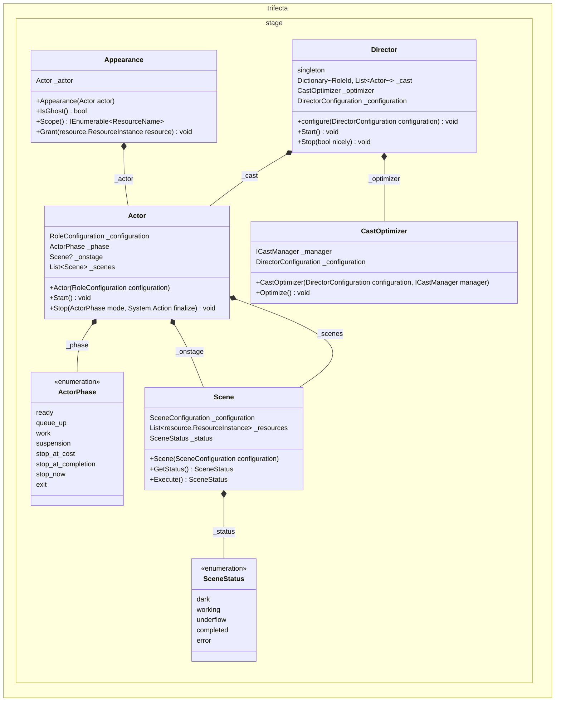

*author: Copilot*

```mermaid
classDiagram
namespace trifecta.stage {
  class Actor {
    RoleConfiguration _configuration
    ActorPhase _phase
    Scene? _onstage
    List~Scene~ _scenes
    +Actor(RoleConfiguration configuration)
    +Start() void
    +Stop(ActorPhase mode, System.Action finalize) void
  }
  class Appearance {
    Actor _actor
    +Appearance(Actor actor)
    +IsGhost() bool
    +Scope() IEnumerable~ResourceName~
    +Grant(resource.ResourceInstance resource) void
  }
  class Scene {
    SceneConfiguration _configuration
    List~resource.ResourceInstance~ _resources
    SceneStatus _status
    +Scene(SceneConfiguration configuration)
    +GetStatus() SceneStatus
    +Execute() SceneStatus
  }
  class Director {
    singleton
    Dictionary~RoleId, List~Actor~~ _cast
    CastOptimizer _optimizer
    DirectorConfiguration _configuration
    +configure(DirectorConfiguration configuration) void
    +Start() void
    +Stop(bool nicely) void
  }
  class CastOptimizer {
    ICastManager _manager
    DirectorConfiguration _configuration
    +CastOptimizer(DirectorConfiguration configuration, ICastManager manager)
    +Optimize() void
  }
  class ActorPhase {
    <<enumeration>>
    ready
    queue_up
    work
    suspension
    stop_at_cost
    stop_at_completion
    stop_now
    exit
  }
  class SceneStatus {
    <<enumeration>>
    dark
    working
    underflow
    completed
    error
  }
}
Actor *-- ActorPhase : _phase
Actor *-- Scene : _onstage
Actor *-- Scene : _scenes
Appearance *-- Actor : _actor
Scene *-- SceneStatus : _status
Director *-- Actor : _cast
Director *-- CastOptimizer : _optimizer
```
