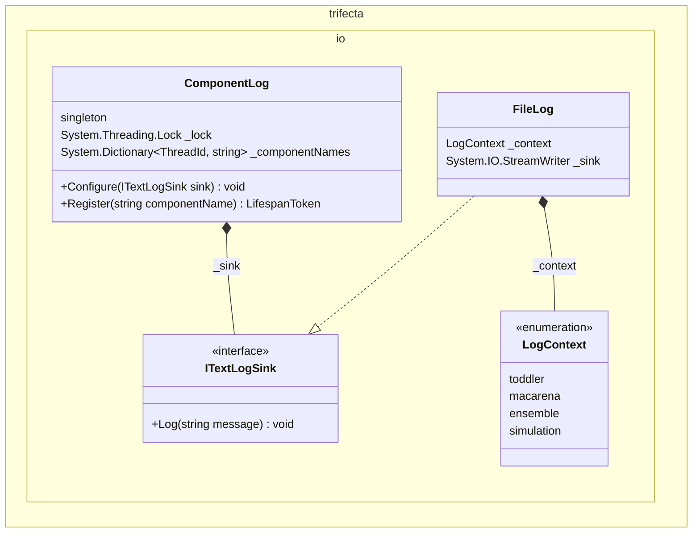

*author: Copilot*

```mermaid
classDiagram
namespace trifecta.io {
  class ComponentLog {
    singleton
    System.Threading.Lock _lock
    System.Dictionary~ThreadId, string~ _componentNames
    +Configure(ITextLogSink sink) void
    +Register(string componentName) LifespanToken
  }
  class ITextLogSink {
    <<interface>>
    +Log(string message) void
  }
  class FileLog {
    LogContext _context
    System.IO.StreamWriter _sink
  }
  class LogContext {
    <<enumeration>>
    toddler
    macarena
    ensemble
    simulation
  }
}
ComponentLog *-- ITextLogSink : _sink
FileLog ..|> ITextLogSink
FileLog *-- LogContext : _context
```
