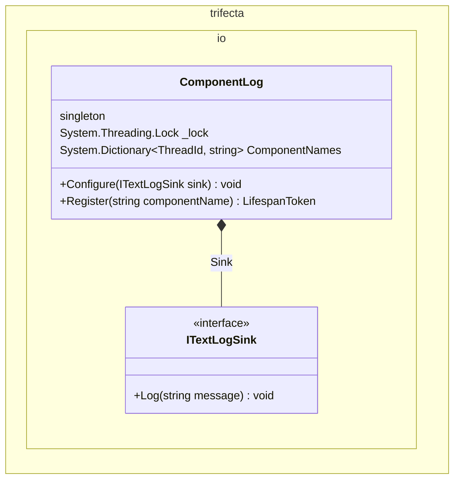

```mermaid
classDiagram
namespace trifecta.io {
  class ComponentLog {
    singleton
    System.Threading.Lock _lock
    System.Dictionary~ThreadId, string~ ComponentNames
    +Configure(ITextLogSink sink) void
    +Register(string componentName) LifespanToken
  }
  class ITextLogSink {
    <<interface>>
    +Log(string message) void
  }
}
ComponentLog *-- ITextLogSink : Sink
```
