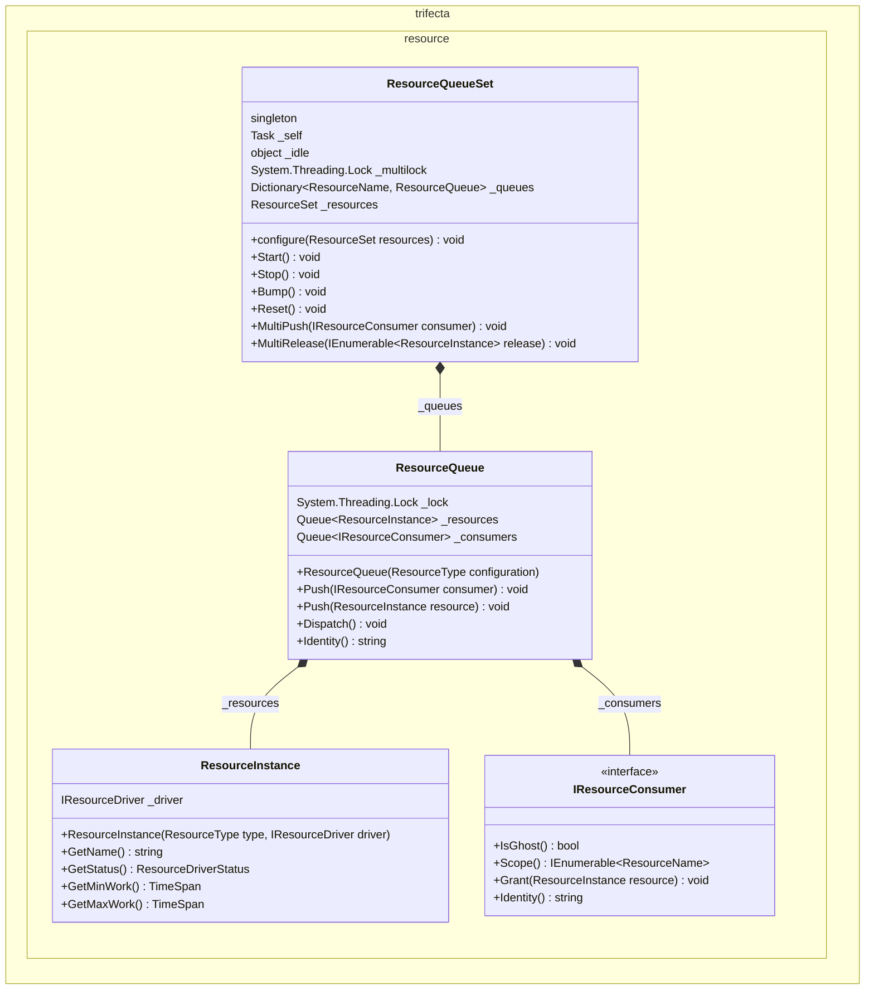

*author: Copilot*

```mermaid
classDiagram
namespace trifecta.resource {
  class ResourceInstance {
    IResourceDriver _driver
    +ResourceInstance(ResourceType type, IResourceDriver driver)
    +GetName() string
    +GetStatus() ResourceDriverStatus
    +GetMinWork() TimeSpan
    +GetMaxWork() TimeSpan
  }
  class ResourceQueueSet {
    singleton
    Task _self
    object _idle
    System.Threading.Lock _multilock
    Dictionary~ResourceName, ResourceQueue~ _queues
    ResourceSet _resources
    +configure(ResourceSet resources) void
    +Start() void
    +Stop() void
    +Bump() void
    +Reset() void
    +MultiPush(IResourceConsumer consumer) void
    +MultiRelease(IEnumerable~ResourceInstance~ release) void
  }
  class ResourceQueue {
    System.Threading.Lock _lock
    Queue~ResourceInstance~ _resources
    Queue~IResourceConsumer~ _consumers
    +ResourceQueue(ResourceType configuration)
    +Push(IResourceConsumer consumer) void
    +Push(ResourceInstance resource) void
    +Dispatch() void
    +Identity() string
  }
  class IResourceConsumer {
    <<interface>>
    +IsGhost() bool
    +Scope() IEnumerable~ResourceName~
    +Grant(ResourceInstance resource) void
    +Identity() string
  }
}
ResourceQueueSet *-- ResourceQueue : _queues
ResourceQueue *-- ResourceInstance : _resources
ResourceQueue *-- IResourceConsumer : _consumers
```
