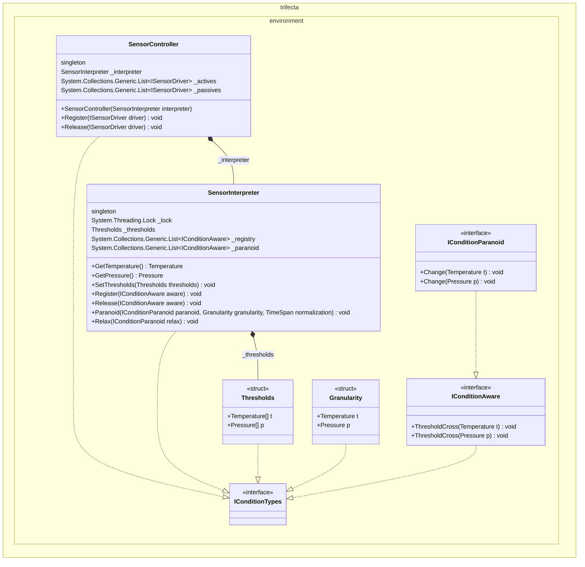

*author: Copilot*

```mermaid
classDiagram
namespace trifecta.environment {
  class SensorController {
    singleton
    SensorInterpreter _interpreter
    System.Collections.Generic.List~ISensorDriver~ _actives
    System.Collections.Generic.List~ISensorDriver~ _passives
    +SensorController(SensorInterpreter interpreter)
    +Register(ISensorDriver driver) void
    +Release(ISensorDriver driver) void
  }
  class SensorInterpreter {
    singleton
    System.Threading.Lock _lock
    Thresholds _thresholds
    System.Collections.Generic.List~IConditionAware~ _registry
    System.Collections.Generic.List~IConditionAware~ _paranoid
    +GetTemperature() Temperature
    +GetPressure() Pressure
    +SetThresholds(Thresholds thresholds) void
    +Register(IConditionAware aware) void
    +Release(IConditionAware aware) void
    +Paranoid(IConditionParanoid paranoid, Granularity granularity, TimeSpan normalization) void
    +Relax(IConditionParanoid relax) void
  }
  class Thresholds {
    <<struct>>
    +Temperature[] t
    +Pressure[] p
  }
  class Granularity {
    <<struct>>
    +Temperature t
    +Pressure p
  }
  class IConditionTypes {
    <<interface>>
  }
  class IConditionAware {
    <<interface>>
    +ThresholdCross(Temperature t) void
    +ThresholdCross(Pressure p) void
  }
  class IConditionParanoid {
    <<interface>>
    +Change(Temperature t) void
    +Change(Pressure p) void
  }
}
SensorController *-- SensorInterpreter : _interpreter
SensorController ..|> IConditionTypes
SensorInterpreter ..|> IConditionTypes
SensorInterpreter *-- Thresholds : _thresholds
Thresholds ..|> IConditionTypes
Granularity ..|> IConditionTypes
IConditionAware ..|> IConditionTypes
IConditionParanoid ..|> IConditionAware
```
