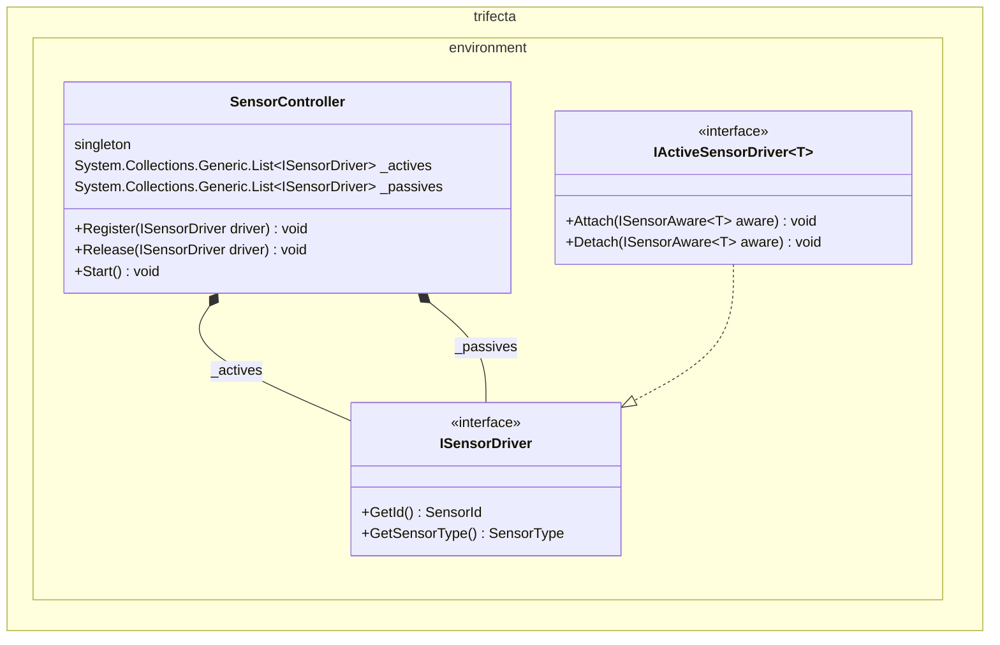

*author: Copilot*

```mermaid
classDiagram
namespace trifecta.environment {
  class SensorController {
    singleton
    System.Collections.Generic.List~ISensorDriver~ _actives
    System.Collections.Generic.List~ISensorDriver~ _passives
    +Register(ISensorDriver driver) void
    +Release(ISensorDriver driver) void
    +Start() void
  }
  class ISensorDriver {
    <<interface>>
    +GetId() SensorId
    +GetSensorType() SensorType
  }
  class IActiveSensorDriver~T~ {
    <<interface>>
    +Attach(ISensorAware~T~ aware) void
    +Detach(ISensorAware~T~ aware) void
  }
}
SensorController *-- ISensorDriver : _actives
SensorController *-- ISensorDriver : _passives
IActiveSensorDriver~T~ ..|> ISensorDriver
```
